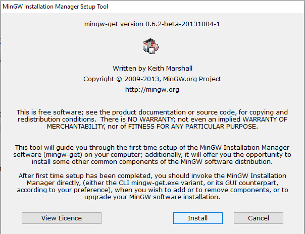
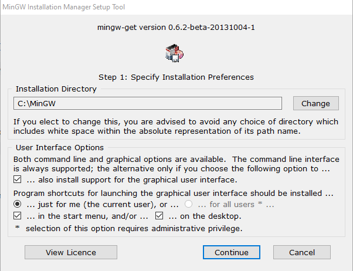
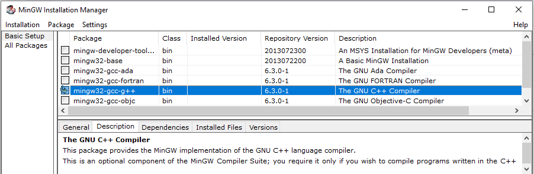

# ꯇꯝꯁꯦ C


Introduction to **C** Programming.

C is a procedural, compiled, platform-dependent language. It needs a compiler and GNU C Compiler is a popular one.

What we will do?

1. Install GCC.
2. Write C program.
3. Compile and run it.

## 1. Install GCC

Install GNU C Compiler (GCC) depending on your Operating System.

### 1.1. On Windows (MinGW)

1. Download [Minimilastic GNU for Windows](https://sourceforge.net/projects/mingw/files/latest/download). After download,
   - Click on the downloaded `mingw-get-setup.exe` file.
   - Click on `Install`.
     
   - Keep default installation directory and click on `Continue`.
     
2. After installation,
   - On Basic Setup, click on checkbox for The GNU C++ Compiler (mingw32-gcc-g++-bin).
     
   - Now click on `Installation` > `Apply Changes`
3. Add to environment variable.
   - Environment variables > System Variables > Path
   - Add `C:\MinGW\bin`.
   - Click OK > OK.
4. You can check in command prompt (cmd) by typing `gcc --version` for which you will get the output like:

   ```cmd
   gcc --version

   gcc (MinGW.org GCC-6.3.0-1) 6.3.0
   Copyright (C) 2016 Free Software Foundation, Inc.
   This is free software; see the source for copying conditions.  There is NO
   warranty; not even for MERCHANTABILITY or FITNESS FOR A PARTICULAR PURPOSE.
   ```

### 1.2. On Ubuntu

Install GCC through either depending on your OS:

```bash
sudo apt-get install build-essential
```

or

```bash
sudo apt-get install gcc
```

### 1.3. On Mac

Install GCC through homebrew.

```zsh
brew install gcc
```

## 2. Write C program

- The theory/lessons are included in `lesson`. Each lesson is stored in a numbered sub-directory.
  - To view it online, click on the lesson directory on github.
  - To view it offline, use any markdown reader to read the markdown files.
  - Or, open it in vs-code > install `Markdown Preview` > open lesson directory > click on README.md > Press Ctrl+K & V to open markdown to the side.
- The programs are included in `lab` in this repository. Each of the C program is stored in a numbered sub-directory. When you open `lab`, the program list will be printed.

  - Change directory to specific directory, say `0001`,

    ```cmd
    cd lab/0001
    ```

  - To run the program, refer Section 3.
  - To switch betwen directories, say `0001` to `1001`,

    ```cmd
    cd ../1001
    ```

## 3. Compile and run it

Say filename: `hello.c`

### 3.1. Method 1

- To compile it on Windows/Ubuntu/Mac,

  ```bash
  gcc hello.c
  ```

- This will create an executable `a.exe` on Windows. To run it,

  ```bash
  ./a
  ```

- This will create an executable `a.out` on Ubuntu/Mac. To run it,

  ```sh
  ./a.out
  ```

### 3.2. Method 2 (Executable)

- To compile it on Windows:

  ```bash
  gcc -o hello.exe hello.c
  ```

- To compile it on Ubuntu/Mac:

  ```bash
  gcc -o hello hello.c
  ```

- After compilation, an executable file will be created (`hello.exe` on windows/ `hello` on Ubuntu/Mac). To run it,

  ```bash
  ./hello
  ```

### 3.3. Method 3 (Coderunner)

- On Visual Studio Code, go to Extensions and search for coderunner and then install it.
- Click play button on C file and it will be run automatically.
- If you need input from user, it will be compiled but not executed. (Refer to the other methods)
